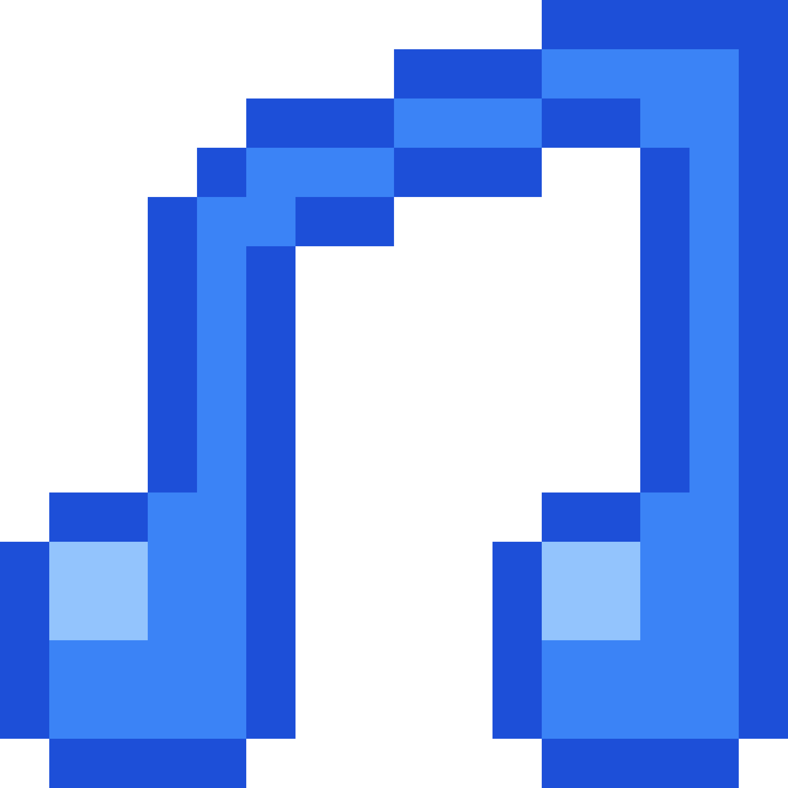
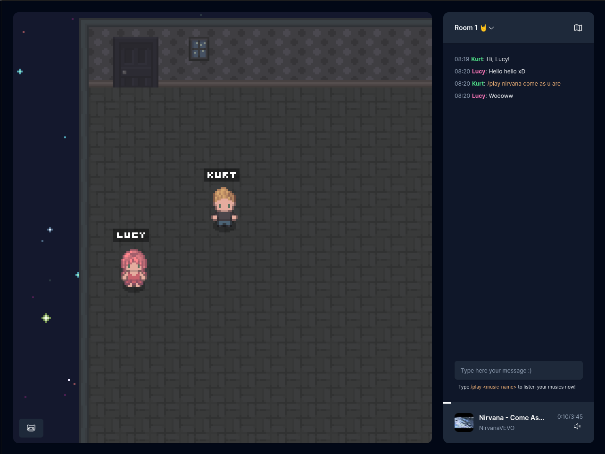

 

  

  <h3 align="center">bumbadum</h3>

  

    A funny place to you listen music
     
    <a href="https://bumbadum.vercel.app"><strong>Explore the app »</strong></a>
     
     
    <a href="https://github.com/lhpegnolatto/bumbadum/issues">Report Bug</a>
    ·
    <a href="https://github.com/lhpegnolatto/bumbadum/issues">Request Feature</a>
  

 

## About The Project

Bumbadum is a creative endeavor that strives to establish a congenial environment for enjoying music with friends. Through customizable avatars and real-time interaction, participants can traverse the virtual landscape, engage with fellow players, and harmoniously synchronize music playback. This project not only facilitates shared music experiences but also serves as a personal journey of exploration, encompassing websockets and game development without external frameworks or engines.

### Built With

- 
- 
- 
- 
- 

## Some TODOs

- [ ] fix wrong animation on others players
- [ ] fix spawn of others users (x and y wrong based on camera person)
- [ ] add playlist functionality
- [ ] add functionality to new users get what music is playing now
- [ ] add skip vote support
- [ ] add dance event

## Contributing

Contributions are what make the open source community such an amazing place to learn, inspire, and create. Any contributions you make are **greatly appreciated**.

If you have a suggestion that would make this better, please fork the repo and create a pull request. You can also simply open an issue with the tag "enhancement".
Don't forget to give the project a star! Thanks again!

1. Fork the Project
2. Create your Feature Branch (`git checkout -b feature/amazing-feature`)
3. Commit your Changes (`git commit -m 'feat: adding amazing things'`)
4. Push to the Branch (`git push origin feature/amazing-feature`)
5. Open a Pull Request

## License

Distributed under the GPL-3.0 License. See `LICENSE.md` for more information.
